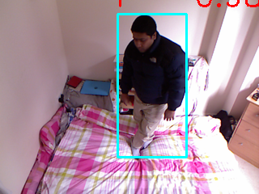

# Fall detection

# Dataset generator
using detectron2 to generate the location label.
### [original dataset](https://falldataset.com/)
### activity class

|original class | 1,4 | 2,3,5 |
|:---------------:|:-----:|:-------:|
|generated class| 1   |   0   |

### [Generated dataset](https://pan.baidu.com/s/12dRo7f5K07tIUMjaQ72SkA) (code:5ubw)

### Train

|name | contents |    
|:----:|:-------:|
|dirs| ("489" "569" "581" "722" "731" "758" "786" "807" "832" "925"  "1219" "1260" "1301" "1373" "1378" "1392" "1790" "1843" "1954" "2123") |
|number |  ~24K  |

- 1: standing
- 0: falling 

### Test

#### [test_output](https://pan.baidu.com/s/1KlReAxii5PYEZOwNF9JVgg)(code:te82)

| class-0 | class-1  |
|:----:|:-------:|
|||
|||
|||
|||

### Model-zoo

|ckpt-name | url | code |
|:----:|:-------:|:-------:|
|model_finetune_iteration_2500000.bin|https://pan.baidu.com/s/1QUhqH5I-CSupLMLb-FUndA|jp9q|
